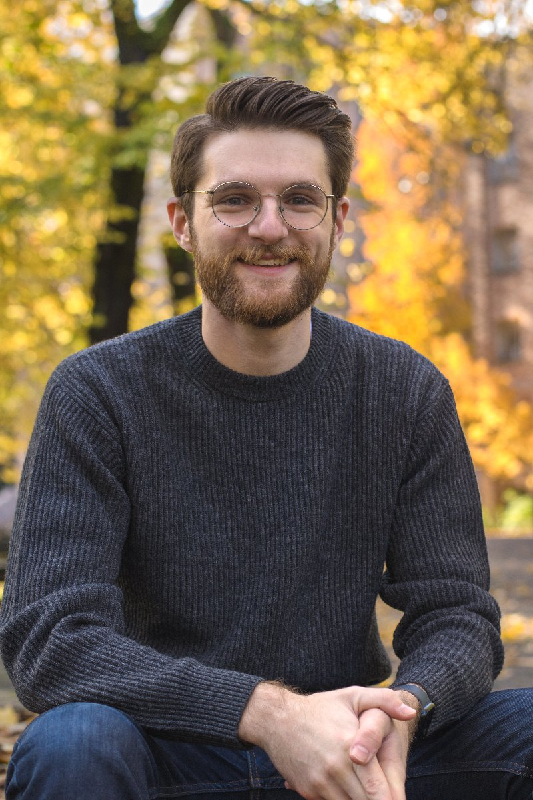

---
execute:
  echo: false
  message: false
  warning: false
description: "Aaron Graybill is a PhD Student at Stanford GSB. He does
research on digital markets and platform design."
image: assets/opengraph.png
image-alt: "Aaron Graybill with an introduction over a blue and green batik-inspired redwood design."
format:
  html:
    include-in-header:
      text: |
        
---
:::: {layout="[[50,-2,50]]" layout-valign="center"}

::: {.intro-card}
<picture>
  <source
    srcset="assets/me-480.webp 480w, assets/me-800.webp 800w"
    type="image/webp">
  
</picture>
<a
  href="https://www.linkedin.com/in/aaron-graybill-194019180/"
  class="social-icon social-linkedin"
  aria-label="Aaron Graybill on LinkedIn">
  <i class="bi bi-linkedin" aria-hidden="true"></i>
</a>
<a
  href="https://github.com/aarongraybill"
  class="social-icon social-github"
  aria-label="Aaron Graybill on GitHub">
  <i class="bi bi-github" aria-hidden="true"></i>
</a>

my email is my full name separated with a period &#64;stanford.edu
:::

::: {intro-text}
Hi, I'm Aaron! I'm a first year PhD student at Stanford Graduate School of Business studying quantitative marketing. Before Stanford, I worked at the Federal Reserve
Bank of Philadelphia with [Kyle Mangum](https://www.philadelphiafed.org/our-people/kyle-mangum) on applied microeconomics.

My research interests lie at the intersection of social science and technology. I hope to contribute to research on misinformation, digital privacy legislation, and the creator economy.

Here is a link to [my CV](Graybill_CV.pdf).

If you're curious about my time as a Fed RA or the PhD application process, feel
free to reach out. I'm especially glad to connect with people with different educational
or demographic backgrounds to my own. I'm always happy to chat and help however I can.

Outside of research, I have a rotating cast of hobbies including film photography
and development, recreational mathematics, various coding projects, and guitar.
:::

::::
